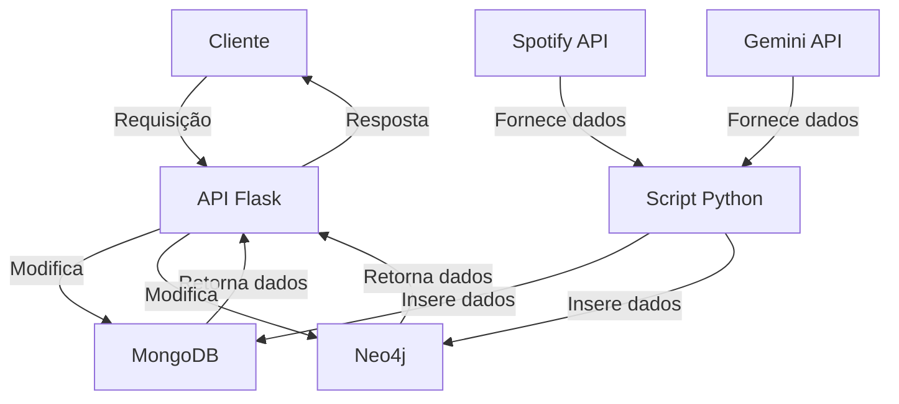

# Processamento Massivo de Dados: Projeto Prático

- **Tema**: Catálogo Musical
- **Integrantes**:
    - Caike Vinicius dos Santos, 802629, caikesantos@estudante.ufscar.br
    - Ryan Guerra Sakurai, 802639, ryansakurai@estudante.ufscar.br
    - Vinicius Silva Castro, 802138, vscastro59@estudante.ufscar.br

## Resumo

O projeto consiste em uma API web de catálogo musical com funcionalidades de rede social e recomendações personalizadas. Permite consultar informações detalhadas sobre artistas e seus lançamentos (álbuns e EPs), incluindo avaliações feitas pelo usuário. Na gestão de usuários, o sistema oferece cadastro e consulta de perfis, manutenção de lista de amigos e possibilidade de seguir artistas de interesse. Usuários podem avaliar lançamentos musicais e revisar seu histórico de avaliações.

O sistema gera recomendações inteligentes: sugere novos artistas com base nas preferências do usuário, recomenda lançamentos considerando avaliações positivas de amigos e indica potenciais novas amizades por afinidade musical. Assim, a plataforma combina acesso a conteúdo musical, interação social e descobertas personalizadas em uma única experiência.

## Funcionalidades do Sistema

### Catálogo Musical

- Obter dados de um artista
- Obter dados de um lançamento
- Calcular média de avaliações de um lançamento
- Listar avaliações de um lançamento

### Gestão de Usuários e Interações

- Registrar usuário
- Obter dados do usuário
- Listar amigos do usuário
- Listar artistas seguidos pelo usuário
- Avaliar um lançamento
- Listar avaliações de um usuário

### Sistema de Recomendações

- Recomendar artistas por gênero musical
- Recomendar lançamentos por avaliações de amigos
- Recomendar amizades por afinidade de gênero
- Recomendar amizades por similaridade de avaliações

## Ferramentas Escolhidas

### MongoDB

A escolha do MongoDB, um banco de dados orientado a documentos, justifica-se pela natureza semi estruturada dos dados musicais. Artistas, lançamentos e usuários possuem atributos variáveis que se adaptam naturalmente ao modelo de documentos flexíveis. Essa característica permite armazenar entidades com hierarquias aninhadas, como um lançamento contendo uma quantidade variável de faixas, sem exigir esquemas rígidos, facilitando futuras evoluções do modelo de dados. A escalabilidade horizontal do MongoDB também é crucial para lidar com o crescimento esperado do catálogo e base de usuários.

### Neo4j

O Neo4j, um banco de dados orientado a grafos, foi selecionado para gerenciar as relações complexas inerentes às funcionalidades sociais e de recomendações. A natureza conectada dos dados, como usuários seguindo artistas, formando amizades e avaliando lançamentos, é naturalmente representada através de nós e arestas. Essa modelagem permite consultas eficientes de caminhos complexos, essenciais para recomendações como "encontrar usuários que avaliaram positivamente os mesmos lançamentos" ou "descobrir artistas similares através de gêneros compartilhados".

### Python

Para o desenvolvimento da API, optou-se por Python com o framework Flask. Python foi escolhido pelo vasto ecossistema de bibliotecas, facilidade de desenvolvimento e natureza dinâmica. O Flask oferece leveza e flexibilidade para construir endpoints RESTful de forma simples e eficiente. Além disso, serão usados as bibliotecas PyMongo e Neo4j Python Driver para comunicação com os bancos de dados.

## Fontes dos Dados

Os dados musicais (artistas, lançamentos e faixas) serão extraídas da [Spotify Web API](https://developer.spotify.com/documentation/web-api) através de seus endpoints públicos, assegurando informações atualizadas e precisas sobre o catálogo musical. Para os dados de usuários, utilizaremos uma abordagem mista: a biblioteca Python Faker será responsável pela geração de dados mais básicos como nomes, enquanto a [Gemini Developer API](https://ai.google.dev/gemini-api/docs) complementará com elementos criativos como biografias personalizadas. Quanto às conexões sociais e às interações serão estabelecidas manualmente através de scripts Python.

## Modelagem dos Dados

### MongoDB

Onde serão armazenados os dados dos usuários, artistas e lançamentos, contendo as seguintes coleções:

- **Usuário:** username (único), nome (opcional), senha, quantidade de amigos, quantidade de artistas seguidos, quantidade de avaliações feitas.
- **Artista:** ID, nome, gêneros, quantidade de seguidores, nível de popularidade, lista de lançamentos.
- **Lançamento:** ID, nome, data de lançamento, quantidade de avaliações, lista de faixas (nome e duração).

### Neo4j

**Tipos de Nó:**

- Artista
- Lançamento
- Gênero
- Usuário

**Tipos de Relacionamento:**

- (Artista) -[Possui]→ (Lançamento)
- (Artista) -[Pertence a]→ (Gênero)
- (Usuário) -[Segue]→ (Artista)
- (Usuário) -[Avaliou {Nota}]→ (Lançamento)
- (Usuário) ←[É Amigo de]→ (Usuário)

