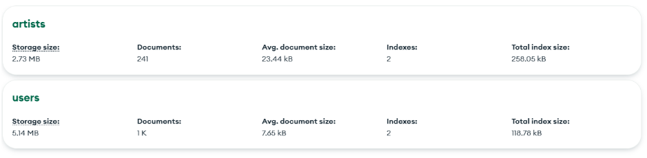
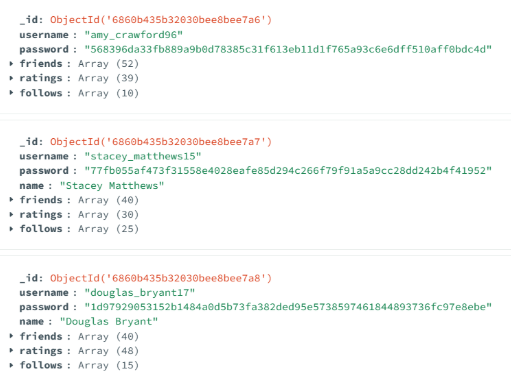
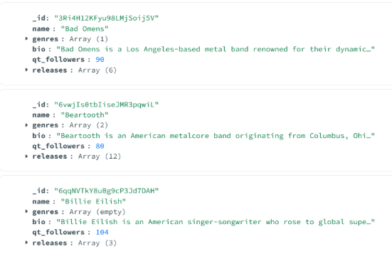
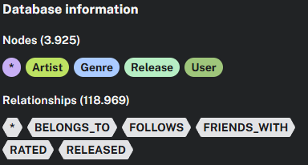
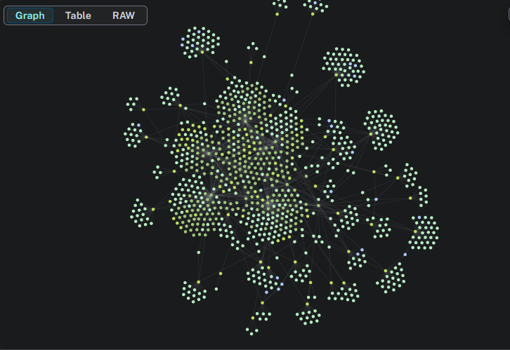
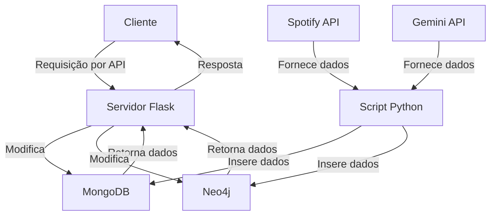

# Projeto de Disciplina – Catálogo Musical

Universidade Federal de São Carlos
Curso: Bacharelado em Ciência da Computação de Sorocaba
Disciplina: Processamento Massivo de Dados
Professora: Profa. Dra. Sahudy Montenegro González

## **Grupo 03**

**Integrantes:**

  - Caike Vinicius dos Santos, 802629, caikesantos@estudante.ufscar.br
  - Ryan Guerra Sakurai, 802639, ryansakurai@estudante.ufscar.br
  - Vinicius Silva Castro, 802138, vscastro59@estudante.ufscar.br

## Resumo:

O projeto consiste em uma API web de catálogo musical com funcionalidades de rede social e recomendações personalizadas. Permite consultar informações detalhadas sobre artistas e seus lançamentos (álbuns e EPs), incluindo avaliações feitas pelo usuário. Na gestão de usuários, o sistema oferece cadastro e consulta de perfis, manutenção de lista de amigos e possibilidade de seguir artistas de interesse. Usuários podem avaliar lançamentos musicais e revisar seu histórico de avaliações.

O sistema gera recomendações inteligentes: sugere novos artistas com base nas preferências do usuário, recomenda lançamentos considerando avaliações positivas de amigos e indica potenciais novas amizades por afinidade musical. Assim, a plataforma combina acesso a conteúdo musical, interação social e descobertas personalizadas em uma única experiência.

## Funcionalidades do Sistema

### Catálogo Musical

- Obter dados de um artista:
    - ID
    - Nome
    - Gêneros
    - Bio (opcional)
    - Quantidade de seguidores
    - Média de avaliações
    - *Preview* da lista de lançamentos (ID, nome e ano de lançamento)
- Listar músicas de um artista
- Obter dados de um lançamento:
    - ID
    - Nome
    - Data de lançamento
    - Média de avaliações
    - Lista de faixas (índice, nome e duração)
- Listar avaliações de um lançamento

### Gestão de Usuários

- Registrar usuário
- Obter dados do usuário:
    - *Username*
    - Nome (opcional)
    - Bio (opcional)
    - Quantidade de amigos
    - Quantidade de artistas seguidos
    - Quantidade de avaliações feitas
- Listar amigos do usuário
- Listar artistas seguidos pelo usuário
- Listar avaliações feitas pelo usuário

### Interações

- Adicionar um amigo
- Seguir um artista
- Avaliar um lançamento

### Sistema de Recomendações

- Recomendar artistas por gênero musical
- Recomendar lançamentos por avaliações de amigos
- Recomendar amizades por afinidade de gênero
- Recomendar amizades por similaridade de avaliações

## Ferramentas Escolhidas

### MongoDB

A escolha do MongoDB como banco de dados orientado a documentos justifica-se pela natureza semiestruturada dos dados musicais e de usuários, que apresentam atributos variáveis e opcionais. Essa flexibilidade permite acomodar campos como biografias de artistas ou usuários que podem estar ausentes em alguns registros, bem como gerenciar estruturas de tamanho variável como a lista de lançamentos de um artista, que cresce indefinidamente. Além disso, a organização em documentos concentra todos os dados relacionados a uma entidade em um único local, otimizando operações como a recuperação de todas as músicas de um artista. Essa abordagem evita percursos custosos e desnecessários em um grafo do Neo4j, por exemplo, para essa operação básica. Complementando essas características, a escalabilidade horizontal nativa do MongoDB também é essencial para o crescimento projetado do catálogo musical e da base de usuários.
Abaixo de como ficou estruturado o mongoDB no projeto:

Usuario:

Artista:

### Neo4j

O Neo4j, um banco de dados orientado a grafos, foi selecionado para gerenciar as relações complexas inerentes às funcionalidades sociais e de recomendações. A natureza conectada dos dados, como usuários seguindo artistas, formando amizades e avaliando lançamentos, é naturalmente representada através de nós e arestas. Essa modelagem permite consultas eficientes de caminhos complexos, essenciais para recomendações como "encontrar usuários que avaliaram positivamente os mesmos lançamentos" ou "descobrir artistas similares através de gêneros compartilhados".
Abaixo, podemos ver como o banco de dados foi estruturado e a visualização dos dados.

Informações sobre nós e relacionamentos dentro do neo4j

Visualização reduziado do grafo de relacionamentos dentro do neo4j

### Python

Para o desenvolvimento da API, optou-se por Python com o framework Flask. Python foi escolhido pelo vasto ecossistema de bibliotecas, facilidade de desenvolvimento e natureza dinâmica. O Flask oferece leveza e flexibilidade para construir endpoints RESTful de forma simples e eficiente. Além disso, serão usados as bibliotecas PyMongo e Neo4j Python Driver para comunicação com os bancos de dados.

## Fontes dos Dados

Os dados musicais (artistas, lançamentos e faixas) serão extraídas da [Spotify Web API](https://developer.spotify.com/documentation/web-api) através da biblioteca [Spotipy](https://spotipy.readthedocs.io/en/2.25.1/), assegurando informações atualizadas e precisas sobre o catálogo musical. Para os dados de usuários, utilizaremos uma abordagem mista: a biblioteca Faker, do Python, será responsável pela geração de dados mais básicos como nomes, enquanto a [Gemini Developer API](https://ai.google.dev/gemini-api/docs) complementará com elementos criativos como biografias personalizadas. Quanto às conexões sociais e às interações serão estabelecidas manualmente através de *scripts* Python.

## Modelagem dos Dados

### MongoDB

Onde serão armazenados os dados dos usuários, artistas e lançamentos, contendo as seguintes coleções:

- **Usuário**: *username* (único), nome (opcional), senha, bio (opcional), lista de amigos, lista de artistas seguidos, lista de avaliações feitas.
    - **Avaliação**: ID do lançamento, artista, nome do lançamento, nota.
- **Artista**: ID, nome, gêneros, bio (opcional), quantidade de seguidores, lista de lançamentos.
    - **Lançamento**: ID (possui índice), nome, data de lançamento, quantidade de avaliações, lista de faixas, lista de avaliações.
        - **Faixa**: índice, nome, duração.
        - **Avaliação**: *username*, nota.

### Neo4j

**Tipos de Nó:**

- Artista {ID, nível de popularidade}
- Lançamento {ID}
- Gênero {Nome}
- Usuário {Username}

**Tipos de Relacionamento:**

- (Artista) -[Lança]→ (Lançamento)
- (Artista) -[Pertence a]→ (Gênero)
- (Usuário) -[Segue]→ (Artista)
- (Usuário) -[Avaliou {Nota}]→ (Lançamento)
- (Usuário) ←[É Amigo de]→ (Usuário)

### Desenvolvimento
Inicialmente, foi definida a modelagem dos dados no MongoDB e no Neo4j, de forma a atender aos requisitos de catálogo musical e de interação social. Em seguida, foram implementados scripts em Python que utilizam a biblioteca Spotipy para recuperar informações de artistas, álbuns e faixas diretamente da Spotify Web API. A geração automatizada de perfis de usuário e biografias foi realizada por meio das ferramentas Faker e Gemini Developer API.
A API foi desenvolvida em Flask diretamente nas rotas, concentrando as operações de acesso aos bancos de dados e a lógica de negócio. As requisições são processadas nessas rotas, com o uso do PyMongo para manipulação dos documentos no MongoDB e do driver oficial do Neo4j para interações com os nós e relacionamentos no grafo. Também foram criados scripts adicionais em Python para popular o grafo com relacionamentos aleatórios entre usuários, artistas e avaliações, simulando uma rede social funcional e fornecendo dados para o sistema de recomendações.
O sistema de recomendações foi projetado para combinar afinidade de gêneros musicais e conexões sociais. Por meio de consultas em Cypher, foi possível identificar artistas que compartilham gêneros com os já seguidos ou avaliados positivamente, além de recomendar lançamentos apreciados por contatos próximos na rede. Um método híbrido também foi adotado, priorizando lançamentos com alta média entre os amigos e, ao mesmo tempo, sugerindo artistas com perfis similares aos gostos do usuário. As recomendações são geradas em tempo real, refletindo imediatamente novas avaliações e relações sociais.
Por se tratar de uma API de catálogo musical, também foi desenvolvida uma documentação técnica apresentando todos os endpoints implementados. A documentação descreve detalhadamente a funcionalidade de cada rota, os parâmetros necessários, os formatos de requisição e resposta, bem como os possíveis códigos e mensagens de erro. Essa padronização visa facilitar a integração com outras aplicações e oferecer maior clareza no uso dos recursos disponibilizados pela API. 
[**CLIQUE AQUI PARA VISUALIZAR A DOCUMENTAÇÃO**](Documentacao.md)

### Dificuldades encontradas
Durante a geração de biografias dos usuários, a principal limitação técnica enfrentada foi a cota diária da Gemini Developer API. Como o número de chamadas era restrito, a criação dos perfis precisou ser distribuída ao longo de vários dias, o que impactou o ritmo de populamento do sistema. Também foi necessário realizar diversos ajustes nos prompts enviados à API para obter descrições que fossem criativas e ao mesmo tempo coerentes com o contexto musical.
Além disso, a criação dos scripts para popular os relacionamentos no Neo4j apresentou desafios. Foi preciso desenvolver uma lógica capaz de gerar conexões aleatórias entre usuários, artistas e avaliações de forma realista e equilibrada, para garantir que o grafo representasse uma rede social funcional. Essa tarefa exigiu várias iterações para ajustar a distribuição e a densidade das relações, de modo a evitar tanto um grafo muito esparso quanto um excessivamente denso.
Durante a construção e o desenvolvimento do sistema, um dos principais desafios técnicos enfrentados foi a padronização dos endpoints criados. Foi necessário definir uma estrutura unificada para as respostas da API, incluindo tanto os retornos de sucesso quanto os de erro, de forma a garantir consistência na comunicação com o cliente. Para isso, desenvolveu-se uma classe dedicada ao tratamento de erros, contemplando os principais cenários que poderiam ocorrer durante o uso do sistema. Essa abordagem não apenas facilitou o desenvolvimento e manutenção do backend, como também contribuiu para uma melhor experiência do usuário, ao permitir mensagens de erro mais claras, padronizadas e contextualizadas.
Outro desafio importante envolveu o desempenho do Neo4j. Consultas muito profundas ou que envolviam um grande volume de nós acabavam comprometendo a performance. Para lidar com isso, foram realizadas otimizações nas consultas Cypher, aplicando limites adequados e ajustando os índices, garantindo um funcionamento mais fluido nas interações com o grafo. 

### Conclusão
O desenvolvimento resultou em uma API que integra catálogo musical, rede social e recomendações inteligentes de maneira coesa e eficiente. A aplicação permite acesso a informações atualizadas da Spotify Web API, gerenciamento de amizades, seguimento de artistas e registro de avaliações, alimentando um grafo de relacionamentos que serve de base para sugestões personalizadas.
A solução demonstra que é possível combinar bancos de dados documentais e de grafos em um mesmo sistema, atendendo a diferentes tipos de consulta com eficiência. A utilização do Flask de forma direta simplifica a arquitetura e oferece uma base sólida e flexível, pronta para receber expansões como interfaces gráficas ou autenticação externa.
O projeto evoluiu significativamente ao longo do desenvolvimento e representou uma oportunidade valiosa de aprofundamento prático no uso de bancos de dados MongoDB e Neo4j. A manipulação de dados documentais e a modelagem de grafos em um contexto real trouxeram aprendizados relevantes sobre desempenho, estruturação de dados e integração entre diferentes modelos de persistência, ampliando a compreensão sobre arquiteturas híbridas e consultas otimizadas.
